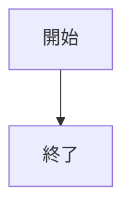
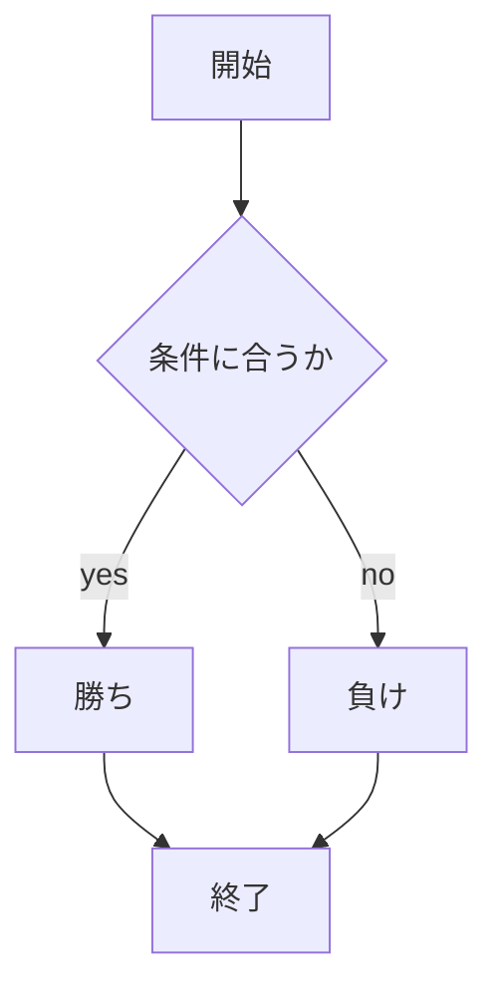

# webpro_06

## このプログラムについて

## ファイル一覧

ファイル名 | 説明
-|-
app.5.js | プログラム本体
public/janken.html | ジャンケンの開始画面
views/janken.ejs | ジャンケンのテンプレートファイル


```javascript
console.log('Hello');
```

1. ```node app5.js```を起動する
1. Webブラウザでlocalhost:8080/public/janken.htmlにアクセスする
1. 自分の手を入力する






## レポート

#### (1)
・起動方法は```node app5.js```とターミナルで起動させ，Webブラウザでlocalhost:8080/public/janken.htmlにアクセスする．janken.htmlの部分はアクセスしたいhtmlの名前を入力する．

・編集したファイルは
```git add .```
```git commit -am 'コメント'```
```git push```
と入力することで，Github上に編集したファイルと編集箇所をコメントしたものをアップロードすることができる．

#### (2)
1. /janken
機能はコンピュータとジャンケンすることである．
```let hand = req.query.hand;```
```let win = Number( req.query.win );```
```let total = Number( req.query.total );```
では，入力したジャンケンの手を読み取るhandと勝利数を読み取るwin，試合数を読み取るtotalの値を取得している．
```const num = Math.floor( Math.random() * 3 + 1 );```
では，1から3までの整数をランダムに決めている．そして，numの値が1ならグーを，2ならチョキ，3ならパーをコンピュータが出すようにしている．また，if文でWebブラウザでユーザーが入力したジャンケンの手とコンピュータが出した手によって勝敗の判定をしていて，totalを1増やし，勝った場合のみwinを1増やす．

2. /attimuitehoi
機能はあっち向いてホイをユーザー側が顔，コンピュータ側が指を動かして行うものである．
```let face = req.query.face;```
```let win = Number( req.query.win );```
```let total = Number( req.query.total );```
では，それぞれ入力した上下左右を読み取るfaceと勝利数を読み取るwin，試合数を読み取るtotalを取得している．
```const num = Math.floor( Math.random() * 4 + 1 );```
では，1から4までの整数をランダムに決めている．そして，numの値が1なら上を，2なら下，3なら右，4なら左をコンピュータが指すようにしている．また，if文でWebブラウザでユーザーが入力した顔の向きとコンピュータが指した方向によって勝敗の判定をしていて，totalを1増やし，勝った場合のみwinを1増やす．

3. /tyouhann
機能は丁半をユーザーが丁か半か決め，コンピュータが出目を出力して行うものである．
```let card = req.query.card;```
```let win = Number( req.query.win );```
```let lose = Number( req.query.lose );```
では，それぞれ入力した丁か半を読み取るcardと勝利数を読み取るwin，敗北数を読み取るloseを取得している．
```const num = Math.floor( Math.random() * 6 + 1 );```
```const num1 = Math.floor( Math.random() * 6 + 1 );```
では，それぞれ1から6までの整数をランダムに決めている．numとnum1の値で出目を定めている．そして，if文でWebブラウザでユーザーが入力した丁か半とコンピュータが出力した出目によって勝敗の判定をしていて，勝った場合のみwinを1増やし，負けた場合のみloseを1増やす．