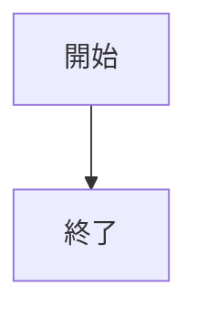
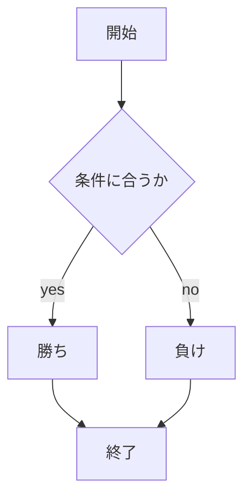

# webpro_06

## このプログラムについて

## ファイル一覧

ファイル名 | 説明
-|-
app.5.js | プログラム本体
public/janken.html | ジャンケンの開始画面
views/janken.ejs | ジャンケンのテンプレートファイル


```javascript
console.log('Hello');
```

1. ```node app5.js```を起動する
1. Webブラウザでlocalhost:8080/public/janken.htmlにアクセスする
1. 自分の手を入力する



